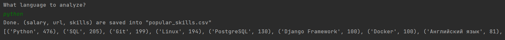

###What is it for?
It aims to help with solving of the major conundrum 'what to learn next'.

### Files
main.py - parses hh.ru and gathers skills-by-popular-demand.
analyze.py - analyzes frequency of required skills 

### Example


###Prerequisites
[Python](https://www.python.org/downloads/)

###Installation
1. Run cmd
2. Go to a folder where the script would be installed ```cd Desktop/tmp```
3. Clone the repo ```git clone https://github.com/awitaminosis/popular_skills```
4. Create virtual environment```python -m venv popular_skills```
5. Go inside ```cd popular_skills```
5. Activate virtual environment ```"scripts/activate.bat"```
6. Install requirements ```pip install -r requirements.txt```
7. Run the script ```python main.py```